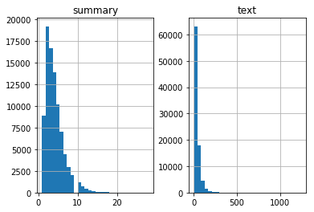
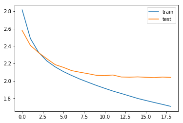

.. code:: ipython3

    from attention import AttentionLayer

.. code:: ipython3

    import numpy as np
    import pandas as pd 
    import re
    from bs4 import BeautifulSoup
    from keras.preprocessing.text import Tokenizer 
    from keras.preprocessing.sequence import pad_sequences
    from nltk.corpus import stopwords
    from tensorflow.keras.layers import Input, LSTM, Embedding, Dense, Concatenate, TimeDistributed
    from tensorflow.keras.models import Model
    from tensorflow.keras.callbacks import EarlyStopping
    import warnings
    pd.set_option("display.max_colwidth", 200)
    warnings.filterwarnings("ignore")

.. parsed-literal::

    Using TensorFlow backend.
    c:\program files\python36\lib\site-packages\tensorflow\python\framework\dtypes.py:516: FutureWarning: Passing (type, 1) or '1type' as a synonym of type is deprecated; in a future version of numpy, it will be understood as (type, (1,)) / '(1,)type'.
      _np_qint8 = np.dtype([("qint8", np.int8, 1)])
    c:\program files\python36\lib\site-packages\tensorflow\python\framework\dtypes.py:517: FutureWarning: Passing (type, 1) or '1type' as a synonym of type is deprecated; in a future version of numpy, it will be understood as (type, (1,)) / '(1,)type'.
      _np_quint8 = np.dtype([("quint8", np.uint8, 1)])
    c:\program files\python36\lib\site-packages\tensorflow\python\framework\dtypes.py:518: FutureWarning: Passing (type, 1) or '1type' as a synonym of type is deprecated; in a future version of numpy, it will be understood as (type, (1,)) / '(1,)type'.
      _np_qint16 = np.dtype([("qint16", np.int16, 1)])
    c:\program files\python36\lib\site-packages\tensorflow\python\framework\dtypes.py:519: FutureWarning: Passing (type, 1) or '1type' as a synonym of type is deprecated; in a future version of numpy, it will be understood as (type, (1,)) / '(1,)type'.
      _np_quint16 = np.dtype([("quint16", np.uint16, 1)])
    c:\program files\python36\lib\site-packages\tensorflow\python\framework\dtypes.py:520: FutureWarning: Passing (type, 1) or '1type' as a synonym of type is deprecated; in a future version of numpy, it will be understood as (type, (1,)) / '(1,)type'.
      _np_qint32 = np.dtype([("qint32", np.int32, 1)])
    c:\program files\python36\lib\site-packages\tensorflow\python\framework\dtypes.py:525: FutureWarning: Passing (type, 1) or '1type' as a synonym of type is deprecated; in a future version of numpy, it will be understood as (type, (1,)) / '(1,)type'.
      np_resource = np.dtype([("resource", np.ubyte, 1)])
    c:\program files\python36\lib\site-packages\tensorboard\compat\tensorflow_stub\dtypes.py:541: FutureWarning: Passing (type, 1) or '1type' as a synonym of type is deprecated; in a future version of numpy, it will be understood as (type, (1,)) / '(1,)type'.
      _np_qint8 = np.dtype([("qint8", np.int8, 1)])
    c:\program files\python36\lib\site-packages\tensorboard\compat\tensorflow_stub\dtypes.py:542: FutureWarning: Passing (type, 1) or '1type' as a synonym of type is deprecated; in a future version of numpy, it will be understood as (type, (1,)) / '(1,)type'.
      _np_quint8 = np.dtype([("quint8", np.uint8, 1)])
    c:\program files\python36\lib\site-packages\tensorboard\compat\tensorflow_stub\dtypes.py:543: FutureWarning: Passing (type, 1) or '1type' as a synonym of type is deprecated; in a future version of numpy, it will be understood as (type, (1,)) / '(1,)type'.
      _np_qint16 = np.dtype([("qint16", np.int16, 1)])
    c:\program files\python36\lib\site-packages\tensorboard\compat\tensorflow_stub\dtypes.py:544: FutureWarning: Passing (type, 1) or '1type' as a synonym of type is deprecated; in a future version of numpy, it will be understood as (type, (1,)) / '(1,)type'.
      _np_quint16 = np.dtype([("quint16", np.uint16, 1)])
    c:\program files\python36\lib\site-packages\tensorboard\compat\tensorflow_stub\dtypes.py:545: FutureWarning: Passing (type, 1) or '1type' as a synonym of type is deprecated; in a future version of numpy, it will be understood as (type, (1,)) / '(1,)type'.
      _np_qint32 = np.dtype([("qint32", np.int32, 1)])
    c:\program files\python36\lib\site-packages\tensorboard\compat\tensorflow_stub\dtypes.py:550: FutureWarning: Passing (type, 1) or '1type' as a synonym of type is deprecated; in a future version of numpy, it will be understood as (type, (1,)) / '(1,)type'.
      np_resource = np.dtype([("resource", np.ubyte, 1)])
    

.. code:: ipython3

    data=pd.read_csv("Reviews.csv",nrows=100000)

.. code:: ipython3

    data

.. raw:: html

    

    
    <table border="1" class="dataframe">
      <thead>
        <tr style="text-align: right;">
          <th></th>
          <th>Id</th>
          <th>ProductId</th>
          <th>UserId</th>
          <th>ProfileName</th>
          <th>HelpfulnessNumerator</th>
          <th>HelpfulnessDenominator</th>
          <th>Score</th>
          <th>Time</th>
          <th>Summary</th>
          <th>Text</th>
        </tr>
      </thead>
      <tbody>
        <tr>
          <th>0</th>
          <td>1</td>
          <td>B001E4KFG0</td>
          <td>A3SGXH7AUHU8GW</td>
          <td>delmartian</td>
          <td>1</td>
          <td>1</td>
          <td>5</td>
          <td>1303862400</td>
          <td>Good Quality Dog Food</td>
          <td>I have bought several of the Vitality canned dog food products and have found them all to be of good quality. The product looks more like a stew than a processed meat and it smells better. My Labr...</td>
        </tr>
        <tr>
          <th>1</th>
          <td>2</td>
          <td>B00813GRG4</td>
          <td>A1D87F6ZCVE5NK</td>
          <td>dll pa</td>
          <td>0</td>
          <td>0</td>
          <td>1</td>
          <td>1346976000</td>
          <td>Not as Advertised</td>
          <td>Product arrived labeled as Jumbo Salted Peanuts...the peanuts were actually small sized unsalted. Not sure if this was an error or if the vendor intended to represent the product as "Jumbo".</td>
        </tr>
        <tr>
          <th>2</th>
          <td>3</td>
          <td>B000LQOCH0</td>
          <td>ABXLMWJIXXAIN</td>
          <td>Natalia Corres "Natalia Corres"</td>
          <td>1</td>
          <td>1</td>
          <td>4</td>
          <td>1219017600</td>
          <td>"Delight" says it all</td>
          <td>This is a confection that has been around a few centuries.  It is a light, pillowy citrus gelatin with nuts - in this case Filberts. And it is cut into tiny squares and then liberally coated with ...</td>
        </tr>
        <tr>
          <th>3</th>
          <td>4</td>
          <td>B000UA0QIQ</td>
          <td>A395BORC6FGVXV</td>
          <td>Karl</td>
          <td>3</td>
          <td>3</td>
          <td>2</td>
          <td>1307923200</td>
          <td>Cough Medicine</td>
          <td>If you are looking for the secret ingredient in Robitussin I believe I have found it.  I got this in addition to the Root Beer Extract I ordered (which was good) and made some cherry soda.  The fl...</td>
        </tr>
        <tr>
          <th>4</th>
          <td>5</td>
          <td>B006K2ZZ7K</td>
          <td>A1UQRSCLF8GW1T</td>
          <td>Michael D. Bigham "M. Wassir"</td>
          <td>0</td>
          <td>0</td>
          <td>5</td>
          <td>1350777600</td>
          <td>Great taffy</td>
          <td>Great taffy at a great price.  There was a wide assortment of yummy taffy.  Delivery was very quick.  If your a taffy lover, this is a deal.</td>
        </tr>
        <tr>
          <th>5</th>
          <td>6</td>
          <td>B006K2ZZ7K</td>
          <td>ADT0SRK1MGOEU</td>
          <td>Twoapennything</td>
          <td>0</td>
          <td>0</td>
          <td>4</td>
          <td>1342051200</td>
          <td>Nice Taffy</td>
          <td>I got a wild hair for taffy and ordered this five pound bag. The taffy was all very enjoyable with many flavors: watermelon, root beer, melon, peppermint, grape, etc. My only complaint is there wa...</td>
        </tr>
        <tr>
          <th>6</th>
          <td>7</td>
          <td>B006K2ZZ7K</td>
          <td>A1SP2KVKFXXRU1</td>
          <td>David C. Sullivan</td>
          <td>0</td>
          <td>0</td>
          <td>5</td>
          <td>1340150400</td>
          <td>Great!  Just as good as the expensive brands!</td>
          <td>This saltwater taffy had great flavors and was very soft and chewy.  Each candy was individually wrapped well.  None of the candies were stuck together, which did happen in the expensive version, ...</td>
        </tr>
        <tr>
          <th>7</th>
          <td>8</td>
          <td>B006K2ZZ7K</td>
          <td>A3JRGQVEQN31IQ</td>
          <td>Pamela G. Williams</td>
          <td>0</td>
          <td>0</td>
          <td>5</td>
          <td>1336003200</td>
          <td>Wonderful, tasty taffy</td>
          <td>This taffy is so good.  It is very soft and chewy.  The flavors are amazing.  I would definitely recommend you buying it.  Very satisfying!!</td>
        </tr>
        <tr>
          <th>8</th>
          <td>9</td>
          <td>B000E7L2R4</td>
          <td>A1MZYO9TZK0BBI</td>
          <td>R. James</td>
          <td>1</td>
          <td>1</td>
          <td>5</td>
          <td>1322006400</td>
          <td>Yay Barley</td>
          <td>Right now I'm mostly just sprouting this so my cats can eat the grass. They love it. I rotate it around with Wheatgrass and Rye too</td>
        </tr>
        <tr>
          <th>9</th>
          <td>10</td>
          <td>B00171APVA</td>
          <td>A21BT40VZCCYT4</td>
          <td>Carol A. Reed</td>
          <td>0</td>
          <td>0</td>
          <td>5</td>
          <td>1351209600</td>
          <td>Healthy Dog Food</td>
          <td>This is a very healthy dog food. Good for their digestion. Also good for small puppies. My dog eats her required amount at every feeding.</td>
        </tr>
        <tr>
          <th>10</th>
          <td>11</td>
          <td>B0001PB9FE</td>
          <td>A3HDKO7OW0QNK4</td>
          <td>Canadian Fan</td>
          <td>1</td>
          <td>1</td>
          <td>5</td>
          <td>1107820800</td>
          <td>The Best Hot Sauce in the World</td>
          <td>I don't know if it's the cactus or the tequila or just the unique combination of ingredients, but the flavour of this hot sauce makes it one of a kind!  We picked up a bottle once on a trip we wer...</td>
        </tr>
        <tr>
          <th>11</th>
          <td>12</td>
          <td>B0009XLVG0</td>
          <td>A2725IB4YY9JEB</td>
          <td>A Poeng "SparkyGoHome"</td>
          <td>4</td>
          <td>4</td>
          <td>5</td>
          <td>1282867200</td>
          <td>My cats LOVE this "diet" food better than their regular food</td>
          <td>One of my boys needed to lose some weight and the other didn't.  I put this food on the floor for the chubby guy, and the protein-rich, no by-product food up higher where only my skinny boy can ju...</td>
        </tr>
        <tr>
          <th>12</th>
          <td>13</td>
          <td>B0009XLVG0</td>
          <td>A327PCT23YH90</td>
          <td>LT</td>
          <td>1</td>
          <td>1</td>
          <td>1</td>
          <td>1339545600</td>
          <td>My Cats Are Not Fans of the New Food</td>
          <td>My cats have been happily eating Felidae Platinum for more than two years. I just got a new bag and the shape of the food is different. They tried the new food when I first put it in their bowls a...</td>
        </tr>
        <tr>
          <th>13</th>
          <td>14</td>
          <td>B001GVISJM</td>
          <td>A18ECVX2RJ7HUE</td>
          <td>willie "roadie"</td>
          <td>2</td>
          <td>2</td>
          <td>4</td>
          <td>1288915200</td>
          <td>fresh and greasy!</td>
          <td>good flavor! these came securely packed... they were fresh and delicious! i love these Twizzlers!</td>
        </tr>
        <tr>
          <th>14</th>
          <td>15</td>
          <td>B001GVISJM</td>
          <td>A2MUGFV2TDQ47K</td>
          <td>Lynrie "Oh HELL no"</td>
          <td>4</td>
          <td>5</td>
          <td>5</td>
          <td>1268352000</td>
          <td>Strawberry Twizzlers - Yummy</td>
          <td>The Strawberry Twizzlers are my guilty pleasure - yummy. Six pounds will be around for a while with my son and I.</td>
        </tr>
        <tr>
          <th>15</th>
          <td>16</td>
          <td>B001GVISJM</td>
          <td>A1CZX3CP8IKQIJ</td>
          <td>Brian A. Lee</td>
          <td>4</td>
          <td>5</td>
          <td>5</td>
          <td>1262044800</td>
          <td>Lots of twizzlers, just what you expect.</td>
          <td>My daughter loves twizzlers and this shipment of six pounds really hit the spot. It's exactly what you would expect...six packages of strawberry twizzlers.</td>
        </tr>
        <tr>
          <th>16</th>
          <td>17</td>
          <td>B001GVISJM</td>
          <td>A3KLWF6WQ5BNYO</td>
          <td>Erica Neathery</td>
          <td>0</td>
          <td>0</td>
          <td>2</td>
          <td>1348099200</td>
          <td>poor taste</td>
          <td>I love eating them and they are good for watching TV and looking at movies! It is not too sweet. I like to transfer them to a zip lock baggie so they stay fresh so I can take my time eating them.</td>
        </tr>
        <tr>
          <th>17</th>
          <td>18</td>
          <td>B001GVISJM</td>
          <td>AFKW14U97Z6QO</td>
          <td>Becca</td>
          <td>0</td>
          <td>0</td>
          <td>5</td>
          <td>1345075200</td>
          <td>Love it!</td>
          <td>I am very satisfied with my Twizzler purchase.  I shared these with others and we have all enjoyed them.  I will definitely be ordering more.</td>
        </tr>
        <tr>
          <th>18</th>
          <td>19</td>
          <td>B001GVISJM</td>
          <td>A2A9X58G2GTBLP</td>
          <td>Wolfee1</td>
          <td>0</td>
          <td>0</td>
          <td>5</td>
          <td>1324598400</td>
          <td>GREAT SWEET CANDY!</td>
          <td>Twizzlers, Strawberry my childhood favorite candy, made in Lancaster Pennsylvania by Y &amp; S Candies, Inc. one of the oldest confectionery Firms in the United States, now a Subsidiary of the Hershey...</td>
        </tr>
        <tr>
          <th>19</th>
          <td>20</td>
          <td>B001GVISJM</td>
          <td>A3IV7CL2C13K2U</td>
          <td>Greg</td>
          <td>0</td>
          <td>0</td>
          <td>5</td>
          <td>1318032000</td>
          <td>Home delivered twizlers</td>
          <td>Candy was delivered very fast and was purchased at a reasonable price.  I was home bound and unable to get to a store so this was perfect for me.</td>
        </tr>
        <tr>
          <th>20</th>
          <td>21</td>
          <td>B001GVISJM</td>
          <td>A1WO0KGLPR5PV6</td>
          <td>mom2emma</td>
          <td>0</td>
          <td>0</td>
          <td>5</td>
          <td>1313452800</td>
          <td>Always fresh</td>
          <td>My husband is a Twizzlers addict.  We've bought these many times from Amazon because we're government employees living overseas and can't get them in the country we are assigned to.  They've alway...</td>
        </tr>
        <tr>
          <th>21</th>
          <td>22</td>
          <td>B001GVISJM</td>
          <td>AZOF9E17RGZH8</td>
          <td>Tammy Anderson</td>
          <td>0</td>
          <td>0</td>
          <td>5</td>
          <td>1308960000</td>
          <td>TWIZZLERS</td>
          <td>I bought these for my husband who is currently overseas. He loves these, and apparently his staff likes them also.&lt;br /&gt;There are generous amounts of Twizzlers in each 16-ounce bag, and this was w...</td>
        </tr>
        <tr>
          <th>22</th>
          <td>23</td>
          <td>B001GVISJM</td>
          <td>ARYVQL4N737A1</td>
          <td>Charles Brown</td>
          <td>0</td>
          <td>0</td>
          <td>5</td>
          <td>1304899200</td>
          <td>Delicious product!</td>
          <td>I can remember buying this candy as a kid and the quality hasn't dropped in all these years. Still a superb product you won't be disappointed with.</td>
        </tr>
        <tr>
          <th>23</th>
          <td>24</td>
          <td>B001GVISJM</td>
          <td>AJ613OLZZUG7V</td>
          <td>Mare's</td>
          <td>0</td>
          <td>0</td>
          <td>5</td>
          <td>1304467200</td>
          <td>Twizzlers</td>
          <td>I love this candy.  After weight watchers I had to cut back but still have a craving for it.</td>
        </tr>
        <tr>
          <th>24</th>
          <td>25</td>
          <td>B001GVISJM</td>
          <td>A22P2J09NJ9HKE</td>
          <td>S. Cabanaugh "jilly pepper"</td>
          <td>0</td>
          <td>0</td>
          <td>5</td>
          <td>1295481600</td>
          <td>Please sell these in Mexico!!</td>
          <td>I have lived out of the US for over 7 yrs now, and I so miss my Twizzlers!!  When I go back to visit or someone visits me, I always stock up.  All I can say is YUM!&lt;br /&gt;Sell these in Mexico and y...</td>
        </tr>
        <tr>
          <th>25</th>
          <td>26</td>
          <td>B001GVISJM</td>
          <td>A3FONPR03H3PJS</td>
          <td>Deborah S. Linzer "Cat Lady"</td>
          <td>0</td>
          <td>0</td>
          <td>5</td>
          <td>1288310400</td>
          <td>Twizzlers - Strawberry</td>
          <td>Product received is as advertised.&lt;br /&gt;&lt;br /&gt;&lt;a href="http://www.amazon.com/gp/product/B001GVISJM"&gt;Twizzlers, Strawberry, 16-Ounce Bags (Pack of 6)&lt;/a&gt;</td>
        </tr>
        <tr>
          <th>26</th>
          <td>27</td>
          <td>B001GVISJM</td>
          <td>A3RXAU2N8KV45G</td>
          <td>lady21</td>
          <td>0</td>
          <td>1</td>
          <td>1</td>
          <td>1332633600</td>
          <td>Nasty No flavor</td>
          <td>The candy is just red , No flavor . Just  plan and chewy .  I would never buy them again</td>
        </tr>
        <tr>
          <th>27</th>
          <td>28</td>
          <td>B001GVISJM</td>
          <td>AAAS38B98HMIK</td>
          <td>Heather Dube</td>
          <td>0</td>
          <td>1</td>
          <td>4</td>
          <td>1331856000</td>
          <td>Great Bargain for the Price</td>
          <td>I was so glad Amazon carried these batteries.  I have a hard time finding them elsewhere because they are such a unique size.  I need them for my garage door opener.&lt;br /&gt;Great deal for the price.</td>
        </tr>
        <tr>
          <th>28</th>
          <td>29</td>
          <td>B00144C10S</td>
          <td>A2F4LZVGFLD1OB</td>
          <td>DaisyH</td>
          <td>0</td>
          <td>0</td>
          <td>5</td>
          <td>1338854400</td>
          <td>YUMMY!</td>
          <td>I got this for my Mum who is not diabetic but needs to watch her sugar intake, and my father who simply chooses to limit unnecessary sugar intake - she's the one with the sweet tooth - they both L...</td>
        </tr>
        <tr>
          <th>29</th>
          <td>30</td>
          <td>B0001PB9FY</td>
          <td>A3HDKO7OW0QNK4</td>
          <td>Canadian Fan</td>
          <td>1</td>
          <td>1</td>
          <td>5</td>
          <td>1107820800</td>
          <td>The Best Hot Sauce in the World</td>
          <td>I don't know if it's the cactus or the tequila or just the unique combination of ingredients, but the flavour of this hot sauce makes it one of a kind!  We picked up a bottle once on a trip we wer...</td>
        </tr>
        <tr>
          <th>...</th>
          <td>...</td>
          <td>...</td>
          <td>...</td>
          <td>...</td>
          <td>...</td>
          <td>...</td>
          <td>...</td>
          <td>...</td>
          <td>...</td>
          <td>...</td>
        </tr>
        <tr>
          <th>99970</th>
          <td>99971</td>
          <td>B000LQORDE</td>
          <td>A1RQB9AVOXN0TF</td>
          <td>mim</td>
          <td>1</td>
          <td>3</td>
          <td>5</td>
          <td>1308614400</td>
          <td>Sooooo Good!</td>
          <td>If you like spicy Ramen noodles, these are the choice for you!  These are just like the ones my husband used to eat in Korea as a kid, so naturally we love them.  Also, they are pretty expensive i...</td>
        </tr>
        <tr>
          <th>99971</th>
          <td>99972</td>
          <td>B000LQORDE</td>
          <td>A3VLYQ6V775LNA</td>
          <td>aaaaa</td>
          <td>1</td>
          <td>3</td>
          <td>5</td>
          <td>1298851200</td>
          <td>Delicious Noodles</td>
          <td>It's the same taste as the one I bought in Asian supermarket which can recall me the Chinese style noodles. Very delicious!</td>
        </tr>
        <tr>
          <th>99972</th>
          <td>99973</td>
          <td>B000LQORDE</td>
          <td>A3K1J1GG2GWNJ1</td>
          <td>margot</td>
          <td>1</td>
          <td>3</td>
          <td>5</td>
          <td>1298678400</td>
          <td>Great noodle texture, spicy flavor</td>
          <td>First of all, kudos to the Super Saver shipping option that I got on ordering two cases of Nong Shim Shin Ramyun. It's made this the most affordable of this type of superior three-minute ramen one...</td>
        </tr>
        <tr>
          <th>99973</th>
          <td>99974</td>
          <td>B000LQORDE</td>
          <td>A2YWRWSLEJRM92</td>
          <td>Pennsylvania Reader</td>
          <td>1</td>
          <td>3</td>
          <td>5</td>
          <td>1295740800</td>
          <td>Supernoodles</td>
          <td>I love these.  It's hard to think of anything else as cheap that is as warming, satisfying, and delicious.  I use a little more water than called for by the directions, then add a few tablespoons ...</td>
        </tr>
        <tr>
          <th>99974</th>
          <td>99975</td>
          <td>B000LQORDE</td>
          <td>AEPEYS74CE6KI</td>
          <td>Daniel Esmond</td>
          <td>1</td>
          <td>3</td>
          <td>5</td>
          <td>1293494400</td>
          <td>It hurts so good!</td>
          <td>I will preface this to say that I like spicy things. From salsa to buffalo wings, I usually like the hottest variety of everything. Imagine my surprise then when I heard of this magical "splcy pic...</td>
        </tr>
        <tr>
          <th>99975</th>
          <td>99976</td>
          <td>B000LQORDE</td>
          <td>A2OMR2QAF5J26E</td>
          <td>EskimoSquirrel</td>
          <td>1</td>
          <td>3</td>
          <td>5</td>
          <td>1292457600</td>
          <td>The best noodle I've ever had</td>
          <td>this is the best noodle I've ever had. Every time I'll add some eggs, vegies. Once you try this, you will never forget it.</td>
        </tr>
        <tr>
          <th>99976</th>
          <td>99977</td>
          <td>B000LQORDE</td>
          <td>A1CVEGNOQ62A25</td>
          <td>Edward</td>
          <td>1</td>
          <td>3</td>
          <td>5</td>
          <td>1288569600</td>
          <td>Spicy</td>
          <td>I was browsing amazon when I came across these noodles and realized I had not had noodles in ages. I used to eat them all the time. The hard brick type noodles you boil in water for 6 minutes.&lt;br ...</td>
        </tr>
        <tr>
          <th>99977</th>
          <td>99978</td>
          <td>B000LQORDE</td>
          <td>A2E2IMMWYCHIG6</td>
          <td>Tessa Noel</td>
          <td>1</td>
          <td>3</td>
          <td>4</td>
          <td>1283040000</td>
          <td>Yum Yum</td>
          <td>This is the best tasting, artery clogging, high blood pressure inducing ramen I have ever tasted.  Yumm!</td>
        </tr>
        <tr>
          <th>99978</th>
          <td>99979</td>
          <td>B000LQORDE</td>
          <td>AWL9HU41JGO9R</td>
          <td>GatorCW</td>
          <td>1</td>
          <td>3</td>
          <td>4</td>
          <td>1283040000</td>
          <td>Pretty good</td>
          <td>Noodles are fine and filling. They make a simple and cheap meal with some vegetables, slices of meat, and eggs thrown in. The spice packet is a bit overwhelming if you're starting out, so stick to...</td>
        </tr>
        <tr>
          <th>99979</th>
          <td>99980</td>
          <td>B000LQORDE</td>
          <td>A1Y8TNPDBS8UKB</td>
          <td>Sean Gerrity</td>
          <td>1</td>
          <td>3</td>
          <td>5</td>
          <td>1275955200</td>
          <td>for adults only</td>
          <td>my first exposure to shin ramyun was about 10 years back at a japanese grocer. all that was available were the shin cups which i picked up as i thought they looked to be the best seller there. at ...</td>
        </tr>
        <tr>
          <th>99980</th>
          <td>99981</td>
          <td>B000LQORDE</td>
          <td>A1DDS96O83SVEA</td>
          <td>R. Flowers</td>
          <td>1</td>
          <td>3</td>
          <td>5</td>
          <td>1253577600</td>
          <td>Nong Shim Shin noodles spicy</td>
          <td>I bought this product strictly on the review of others and they were right, these noodles are great, way better than top ramen.  I will be buying these again.</td>
        </tr>
        <tr>
          <th>99981</th>
          <td>99982</td>
          <td>B000LQORDE</td>
          <td>A1YH21OL6SC2MY</td>
          <td>Jiachun Guo</td>
          <td>1</td>
          <td>3</td>
          <td>4</td>
          <td>1252713600</td>
          <td>A delicious noodle with good price</td>
          <td>It is hot and delicious. the noodle is very good. although later I found it a little cheaper at local Asian food mart.</td>
        </tr>
        <tr>
          <th>99982</th>
          <td>99983</td>
          <td>B000LQORDE</td>
          <td>A12VDYKZ6BIQ9L</td>
          <td>Daniel Levenson "danfromfla"</td>
          <td>1</td>
          <td>3</td>
          <td>5</td>
          <td>1244937600</td>
          <td>Very Tasty Noodles</td>
          <td>What can I say?  They are very spicy, tasty noodles.  My wife loves these noodles and buys them from an asian market that is about 20 miles away from the house.  I'm very happy Amazon sells them f...</td>
        </tr>
        <tr>
          <th>99983</th>
          <td>99984</td>
          <td>B000LQORDE</td>
          <td>A2EOLB7LR508ES</td>
          <td>Chris,  CA</td>
          <td>1</td>
          <td>3</td>
          <td>5</td>
          <td>1241395200</td>
          <td>Good deal at Amazon!</td>
          <td>I have purchased this noodle from local supermarket for years. Due to the rising cost of everything, it got more expensive then ever.  I was please to find that Amazon carry this, with the promoti...</td>
        </tr>
        <tr>
          <th>99984</th>
          <td>99985</td>
          <td>B000LQORDE</td>
          <td>A1YVCGV8G16OMM</td>
          <td>Nathan</td>
          <td>1</td>
          <td>3</td>
          <td>5</td>
          <td>1239148800</td>
          <td>To steal a tagline...mmm, mmm good!</td>
          <td>This stuff is awesome! It has the right amount of spice (a-lot) and the noodles are much thicker and more flavorful than the standard $.10 a pack stuff. Don't get me wrong, I love regular Top Rame...</td>
        </tr>
        <tr>
          <th>99985</th>
          <td>99986</td>
          <td>B000LQORDE</td>
          <td>A1BN8134NN8IAC</td>
          <td>Jorge A. Zuniga "CerealLOVER"</td>
          <td>1</td>
          <td>3</td>
          <td>5</td>
          <td>1239062400</td>
          <td>nong shim</td>
          <td>Just about any nong shim soup is good. Most of them are very spicy and addicting. I really like the chicken and original spicy noodles...Yeah it has MSG but just about every soup does including na...</td>
        </tr>
        <tr>
          <th>99986</th>
          <td>99987</td>
          <td>B000LQORDE</td>
          <td>A30Z0GG96D11EO</td>
          <td>Sofia Hernandez "Shut up B*&amp;#$!"</td>
          <td>1</td>
          <td>3</td>
          <td>5</td>
          <td>1236124800</td>
          <td>Yummy al dente noodles in my bowl!</td>
          <td>I bought these on a whim because they were a deal of the day.  Boy am I glad that I did.  As a big fan of Maruchan and Top Ramen, I read the reviews and saw that these were very close to the real ...</td>
        </tr>
        <tr>
          <th>99987</th>
          <td>99988</td>
          <td>B000LQORDE</td>
          <td>A19SFNK8QI1JZI</td>
          <td>Jerri</td>
          <td>4</td>
          <td>8</td>
          <td>1</td>
          <td>1292025600</td>
          <td>Tastes very very awful</td>
          <td>Apparently they used too much synthetic flavors that it just burns your tongue. Also there's too much oil ... almost made me choke ...</td>
        </tr>
        <tr>
          <th>99988</th>
          <td>99989</td>
          <td>B000LQORDE</td>
          <td>ATPRSDCBH6O9L</td>
          <td>Jiashen You "statistician"</td>
          <td>4</td>
          <td>8</td>
          <td>5</td>
          <td>1254528000</td>
          <td>What else can you ask for at a discounted price?</td>
          <td>Stacks of these shin ramyun are stored and sold at each and every Korean airport Duty Free Shops (in a different packing style). I for one am not complaining for buying it at an average of under 1...</td>
        </tr>
        <tr>
          <th>99989</th>
          <td>99990</td>
          <td>B000LQORDE</td>
          <td>A3NIPWPJSFOZZT</td>
          <td>Won H. Lee</td>
          <td>4</td>
          <td>8</td>
          <td>5</td>
          <td>1234483200</td>
          <td>This is THE ramen</td>
          <td>I been to several places around the world, including Russia and Mongolia. There, if you ask for "ramen", this ramen (Shin Ramen) is the one they give you. it's the best!&lt;br /&gt;&lt;br /&gt;While by itself...</td>
        </tr>
        <tr>
          <th>99990</th>
          <td>99991</td>
          <td>B000LQORDE</td>
          <td>A294C2HWGIVYLS</td>
          <td>Den</td>
          <td>7</td>
          <td>13</td>
          <td>1</td>
          <td>1291939200</td>
          <td>over price</td>
          <td>This item is really over price, i can buy the same from local Asian grocery stores and it is a lot cheaper.</td>
        </tr>
        <tr>
          <th>99991</th>
          <td>99992</td>
          <td>B000LQORDE</td>
          <td>A2JXVMU6OMK6XI</td>
          <td>Healthy Jake</td>
          <td>2</td>
          <td>5</td>
          <td>2</td>
          <td>1315440000</td>
          <td>wow... just plain nasty</td>
          <td>I would have to say the noodles packaged with this product are just plain bad. The spice packet is on par with whats to be expected but the noodles just taste bad.</td>
        </tr>
        <tr>
          <th>99992</th>
          <td>99993</td>
          <td>B000LQORDE</td>
          <td>ANTN4ULDPYM07</td>
          <td>AB</td>
          <td>2</td>
          <td>5</td>
          <td>5</td>
          <td>1284768000</td>
          <td>My new favorite ramen, thanks to amazon</td>
          <td>I originally decided to purchase this particular brand of ramen after seeing all the other positive reviews here on Amazon. I was a bit apprehensive at first, fearing that I wouldn't enjoy it sinc...</td>
        </tr>
        <tr>
          <th>99993</th>
          <td>99994</td>
          <td>B000LQORDE</td>
          <td>A2BXV5BQYXU6HP</td>
          <td>boolean</td>
          <td>2</td>
          <td>5</td>
          <td>5</td>
          <td>1282953600</td>
          <td>great stuff</td>
          <td>this stuff is awesome.  for best flavor boil it in water, drain the water, add spice packet and then add hot water.</td>
        </tr>
        <tr>
          <th>99994</th>
          <td>99995</td>
          <td>B000LQORDE</td>
          <td>AL22WN8RBBOW7</td>
          <td>LifeInTheCity "trogg"</td>
          <td>2</td>
          <td>5</td>
          <td>5</td>
          <td>1256428800</td>
          <td>Good Stuff</td>
          <td>I love these noodle.  A little to spicy for the wife but perfct for me.</td>
        </tr>
        <tr>
          <th>99995</th>
          <td>99996</td>
          <td>B000LQORDE</td>
          <td>A2P7HIRYYWVOBD</td>
          <td>Mason</td>
          <td>2</td>
          <td>5</td>
          <td>5</td>
          <td>1254096000</td>
          <td>yummy!</td>
          <td>I just love it and will buy another box when I'm done with last one!</td>
        </tr>
        <tr>
          <th>99996</th>
          <td>99997</td>
          <td>B000LQORDE</td>
          <td>A1K0ZH5MQFBA77</td>
          <td>jennilight</td>
          <td>2</td>
          <td>5</td>
          <td>4</td>
          <td>1250985600</td>
          <td>Tastes like More!</td>
          <td>My late father in law used to have a rating system for meals: if it was particularly tasty, he'd say "This tastes like more!" That's exactly how I felt the first time I tried a spicy picante ramyu...</td>
        </tr>
        <tr>
          <th>99997</th>
          <td>99998</td>
          <td>B000LQORDE</td>
          <td>A29FRN2O7LWINL</td>
          <td>T. Tsai</td>
          <td>2</td>
          <td>5</td>
          <td>5</td>
          <td>1237766400</td>
          <td>Great ramen</td>
          <td>This is my favorite brand of Korean ramen. It is spicy so if you are not used to eating spicy food, make sure you don't use all of the spice pack. If you add an egg to the soup, it makes a great s...</td>
        </tr>
        <tr>
          <th>99998</th>
          <td>99999</td>
          <td>B000LQORDE</td>
          <td>A9Q950IPXJR1D</td>
          <td>Lynda "casual customer"</td>
          <td>2</td>
          <td>5</td>
          <td>4</td>
          <td>1237161600</td>
          <td>Spicy!!</td>
          <td>I do like these noodles although, to say they are spicy is somewhat of an understatement. No one else in the family tolerates spicy very well so, seeing these, I was looking forward to an extra li...</td>
        </tr>
        <tr>
          <th>99999</th>
          <td>100000</td>
          <td>B000LQORDE</td>
          <td>A19W47CXJJP1MI</td>
          <td>Amazonian Consumer</td>
          <td>2</td>
          <td>5</td>
          <td>5</td>
          <td>1235088000</td>
          <td>This spicy noodle cures my cold, upset stomach, and headache every time!</td>
          <td>I love this noodle and have it once or twice a week. The amazing thing is that when I don't feel well because of a cold, a hot bowl of this noodle will cure my upset stomach, headache, and running...</td>
        </tr>
      </tbody>
    </table>
    
100000 rows × 10 columns

    

.. code:: ipython3

    data.drop_duplicates(subset=['Text'],inplace=True)#dropping duplicates
    data.dropna(axis=0,inplace=True)#dropping na

.. code:: ipython3

    data.info()

.. parsed-literal::

    <class 'pandas.core.frame.DataFrame'>
    Int64Index: 88421 entries, 0 to 99999
    Data columns (total 10 columns):
    Id                        88421 non-null int64
    ProductId                 88421 non-null object
    UserId                    88421 non-null object
    ProfileName               88421 non-null object
    HelpfulnessNumerator      88421 non-null int64
    HelpfulnessDenominator    88421 non-null int64
    Score                     88421 non-null int64
    Time                      88421 non-null int64
    Summary                   88421 non-null object
    Text                      88421 non-null object
    dtypes: int64(5), object(5)
    memory usage: 7.4+ MB
    

.. code:: ipython3

    contraction_mapping = {"ain't": "is not", "aren't": "are not","can't": "cannot", "'cause": "because", "could've": "could have", "couldn't": "could not",
                               "didn't": "did not",  "doesn't": "does not", "don't": "do not", "hadn't": "had not", "hasn't": "has not", "haven't": "have not",
                               "he'd": "he would","he'll": "he will", "he's": "he is", "how'd": "how did", "how'd'y": "how do you", "how'll": "how will", "how's": "how is",
                               "I'd": "I would", "I'd've": "I would have", "I'll": "I will", "I'll've": "I will have","I'm": "I am", "I've": "I have", "i'd": "i would",
                               "i'd've": "i would have", "i'll": "i will",  "i'll've": "i will have","i'm": "i am", "i've": "i have", "isn't": "is not", "it'd": "it would",
                               "it'd've": "it would have", "it'll": "it will", "it'll've": "it will have","it's": "it is", "let's": "let us", "ma'am": "madam",
                               "mayn't": "may not", "might've": "might have","mightn't": "might not","mightn't've": "might not have", "must've": "must have",
                               "mustn't": "must not", "mustn't've": "must not have", "needn't": "need not", "needn't've": "need not have","o'clock": "of the clock",
                               "oughtn't": "ought not", "oughtn't've": "ought not have", "shan't": "shall not", "sha'n't": "shall not", "shan't've": "shall not have",
                               "she'd": "she would", "she'd've": "she would have", "she'll": "she will", "she'll've": "she will have", "she's": "she is",
                               "should've": "should have", "shouldn't": "should not", "shouldn't've": "should not have", "so've": "so have","so's": "so as",
                               "this's": "this is","that'd": "that would", "that'd've": "that would have", "that's": "that is", "there'd": "there would",
                               "there'd've": "there would have", "there's": "there is", "here's": "here is","they'd": "they would", "they'd've": "they would have",
                               "they'll": "they will", "they'll've": "they will have", "they're": "they are", "they've": "they have", "to've": "to have",
                               "wasn't": "was not", "we'd": "we would", "we'd've": "we would have", "we'll": "we will", "we'll've": "we will have", "we're": "we are",
                               "we've": "we have", "weren't": "were not", "what'll": "what will", "what'll've": "what will have", "what're": "what are",
                               "what's": "what is", "what've": "what have", "when's": "when is", "when've": "when have", "where'd": "where did", "where's": "where is",
                               "where've": "where have", "who'll": "who will", "who'll've": "who will have", "who's": "who is", "who've": "who have",
                               "why's": "why is", "why've": "why have", "will've": "will have", "won't": "will not", "won't've": "will not have",
                               "would've": "would have", "wouldn't": "would not", "wouldn't've": "would not have", "y'all": "you all",
                               "y'all'd": "you all would","y'all'd've": "you all would have","y'all're": "you all are","y'all've": "you all have",
                               "you'd": "you would", "you'd've": "you would have", "you'll": "you will", "you'll've": "you will have",
                               "you're": "you are", "you've": "you have"}

.. code:: ipython3

    contraction_mapping

.. parsed-literal::

    {"ain't": 'is not',
     "aren't": 'are not',
     "can't": 'cannot',
     "'cause": 'because',
     "could've": 'could have',
     "couldn't": 'could not',
     "didn't": 'did not',
     "doesn't": 'does not',
     "don't": 'do not',
     "hadn't": 'had not',
     "hasn't": 'has not',
     "haven't": 'have not',
     "he'd": 'he would',
     "he'll": 'he will',
     "he's": 'he is',
     "how'd": 'how did',
     "how'd'y": 'how do you',
     "how'll": 'how will',
     "how's": 'how is',
     "I'd": 'I would',
     "I'd've": 'I would have',
     "I'll": 'I will',
     "I'll've": 'I will have',
     "I'm": 'I am',
     "I've": 'I have',
     "i'd": 'i would',
     "i'd've": 'i would have',
     "i'll": 'i will',
     "i'll've": 'i will have',
     "i'm": 'i am',
     "i've": 'i have',
     "isn't": 'is not',
     "it'd": 'it would',
     "it'd've": 'it would have',
     "it'll": 'it will',
     "it'll've": 'it will have',
     "it's": 'it is',
     "let's": 'let us',
     "ma'am": 'madam',
     "mayn't": 'may not',
     "might've": 'might have',
     "mightn't": 'might not',
     "mightn't've": 'might not have',
     "must've": 'must have',
     "mustn't": 'must not',
     "mustn't've": 'must not have',
     "needn't": 'need not',
     "needn't've": 'need not have',
     "o'clock": 'of the clock',
     "oughtn't": 'ought not',
     "oughtn't've": 'ought not have',
     "shan't": 'shall not',
     "sha'n't": 'shall not',
     "shan't've": 'shall not have',
     "she'd": 'she would',
     "she'd've": 'she would have',
     "she'll": 'she will',
     "she'll've": 'she will have',
     "she's": 'she is',
     "should've": 'should have',
     "shouldn't": 'should not',
     "shouldn't've": 'should not have',
     "so've": 'so have',
     "so's": 'so as',
     "this's": 'this is',
     "that'd": 'that would',
     "that'd've": 'that would have',
     "that's": 'that is',
     "there'd": 'there would',
     "there'd've": 'there would have',
     "there's": 'there is',
     "here's": 'here is',
     "they'd": 'they would',
     "they'd've": 'they would have',
     "they'll": 'they will',
     "they'll've": 'they will have',
     "they're": 'they are',
     "they've": 'they have',
     "to've": 'to have',
     "wasn't": 'was not',
     "we'd": 'we would',
     "we'd've": 'we would have',
     "we'll": 'we will',
     "we'll've": 'we will have',
     "we're": 'we are',
     "we've": 'we have',
     "weren't": 'were not',
     "what'll": 'what will',
     "what'll've": 'what will have',
     "what're": 'what are',
     "what's": 'what is',
     "what've": 'what have',
     "when's": 'when is',
     "when've": 'when have',
     "where'd": 'where did',
     "where's": 'where is',
     "where've": 'where have',
     "who'll": 'who will',
     "who'll've": 'who will have',
     "who's": 'who is',
     "who've": 'who have',
     "why's": 'why is',
     "why've": 'why have',
     "will've": 'will have',
     "won't": 'will not',
     "won't've": 'will not have',
     "would've": 'would have',
     "wouldn't": 'would not',
     "wouldn't've": 'would not have',
     "y'all": 'you all',
     "y'all'd": 'you all would',
     "y'all'd've": 'you all would have',
     "y'all're": 'you all are',
     "y'all've": 'you all have',
     "you'd": 'you would',
     "you'd've": 'you would have',
     "you'll": 'you will',
     "you'll've": 'you will have',
     "you're": 'you are',
     "you've": 'you have'}

.. code:: ipython3

    stop_words = set(stopwords.words('english')) 
    
    def text_cleaner(text,num):
        newString = text.lower()
        newString = BeautifulSoup(newString, "lxml").text
        newString = re.sub(r'\([^)]*\)', '', newString)
        newString = re.sub('"','', newString)
        newString = ' '.join([contraction_mapping[t] if t in contraction_mapping else t for t in newString.split(" ")])    
        newString = re.sub(r"'s\b","",newString)
        newString = re.sub("[^a-zA-Z]", " ", newString) 
        newString = re.sub('[m]{2,}', 'mm', newString)
        if(num==0):
            tokens = [w for w in newString.split() if not w in stop_words]
        else:
            tokens=newString.split()
        long_words=[]
        for i in tokens:
            if len(i)>1:                                                 #removing short word
                long_words.append(i)   
        return (" ".join(long_words)).strip()

.. code:: ipython3

    #call the function
    cleaned_text = []
    for t in data['Text']:
        cleaned_text.append(text_cleaner(t,0)) 

.. code:: ipython3

    cleaned_text[:5]  

.. parsed-literal::

    ['bought several vitality canned dog food products found good quality product looks like stew processed meat smells better labrador finicky appreciates product better',
     'product arrived labeled jumbo salted peanuts peanuts actually small sized unsalted sure error vendor intended represent product jumbo',
     'confection around centuries light pillowy citrus gelatin nuts case filberts cut tiny squares liberally coated powdered sugar tiny mouthful heaven chewy flavorful highly recommend yummy treat familiar story lewis lion witch wardrobe treat seduces edmund selling brother sisters witch',
     'looking secret ingredient robitussin believe found got addition root beer extract ordered made cherry soda flavor medicinal',
     'great taffy great price wide assortment yummy taffy delivery quick taffy lover deal']

.. code:: ipython3

    #call the function
    cleaned_summary = []
    for t in data['Summary']:
        cleaned_summary.append(text_cleaner(t,1))

.. code:: ipython3

    cleaned_summary[:10]

.. parsed-literal::

    ['good quality dog food',
     'not as advertised',
     'delight says it all',
     'cough medicine',
     'great taffy',
     'nice taffy',
     'great just as good as the expensive brands',
     'wonderful tasty taffy',
     'yay barley',
     'healthy dog food']

.. code:: ipython3

    data['cleaned_text']=cleaned_text
    data['cleaned_summary']=cleaned_summary

.. code:: ipython3

    data.replace('', np.nan, inplace=True)
    data.dropna(axis=0,inplace=True)

.. code:: ipython3

    import matplotlib.pyplot as plt
    
    text_word_count = []
    summary_word_count = []
    
    # populate the lists with sentence lengths
    for i in data['cleaned_text']:
          text_word_count.append(len(i.split()))
    
    for i in data['cleaned_summary']:
          summary_word_count.append(len(i.split()))
    
    length_df = pd.DataFrame({'text':text_word_count, 'summary':summary_word_count})
    
    length_df.hist(bins = 30)
    plt.show()

.. code:: ipython3

    cnt=0
    for i in data['cleaned_summary']:
        if(len(i.split())<=8):
            cnt=cnt+1
    print(cnt/len(data['cleaned_summary']))

.. parsed-literal::

    0.9424907471335922
    

.. code:: ipython3

    max_text_len=30
    max_summary_len=8

.. code:: ipython3

    cleaned_text =np.array(data['cleaned_text'])
    cleaned_summary=np.array(data['cleaned_summary'])
    
    short_text=[]
    short_summary=[]
    
    for i in range(len(cleaned_text)):
        if(len(cleaned_summary[i].split())<=max_summary_len and len(cleaned_text[i].split())<=max_text_len):
            short_text.append(cleaned_text[i])
            short_summary.append(cleaned_summary[i])
            
    df=pd.DataFrame({'text':short_text,'summary':short_summary})

.. code:: ipython3

    df['summary'] = df['summary'].apply(lambda x : 'sostok '+ x + ' eostok')

.. code:: ipython3

    from sklearn.model_selection import train_test_split
    x_tr,x_val,y_tr,y_val=train_test_split(np.array(df['text']),np.array(df['summary']),test_size=0.1,random_state=0,shuffle=True) 

.. code:: ipython3

    from keras.preprocessing.text import Tokenizer 
    from keras.preprocessing.sequence import pad_sequences
    
    #prepare a tokenizer for reviews on training data
    x_tokenizer = Tokenizer() 
    x_tokenizer.fit_on_texts(list(x_tr))

.. code:: ipython3

    thresh=4
    
    cnt=0
    tot_cnt=0
    freq=0
    tot_freq=0
    
    for key,value in x_tokenizer.word_counts.items():
        tot_cnt=tot_cnt+1
        tot_freq=tot_freq+value
        if(value<thresh):
            cnt=cnt+1
            freq=freq+value
        
    print("% of rare words in vocabulary:",(cnt/tot_cnt)*100)
    print("Total Coverage of rare words:",(freq/tot_freq)*100)

.. parsed-literal::

    % of rare words in vocabulary: 66.12339930151339
    Total Coverage of rare words: 2.953684513790566
    

.. code:: ipython3

    #prepare a tokenizer for reviews on training data
    x_tokenizer = Tokenizer(num_words=tot_cnt-cnt) 
    x_tokenizer.fit_on_texts(list(x_tr))
    
    #convert text sequences into integer sequences
    x_tr_seq    =   x_tokenizer.texts_to_sequences(x_tr) 
    x_val_seq   =   x_tokenizer.texts_to_sequences(x_val)
    
    #padding zero upto maximum length
    x_tr    =   pad_sequences(x_tr_seq,  maxlen=max_text_len, padding='post')
    x_val   =   pad_sequences(x_val_seq, maxlen=max_text_len, padding='post')
    
    #size of vocabulary ( +1 for padding token)
    x_voc   =  x_tokenizer.num_words + 1

.. code:: ipython3

    x_voc

.. parsed-literal::

    8440

.. code:: ipython3

    #prepare a tokenizer for reviews on training data
    y_tokenizer = Tokenizer()   
    y_tokenizer.fit_on_texts(list(y_tr))

.. code:: ipython3

    thresh=6
    
    cnt=0
    tot_cnt=0
    freq=0
    tot_freq=0
    
    for key,value in y_tokenizer.word_counts.items():
        tot_cnt=tot_cnt+1
        tot_freq=tot_freq+value
        if(value<thresh):
            cnt=cnt+1
            freq=freq+value
        
    print("% of rare words in vocabulary:",(cnt/tot_cnt)*100)
    print("Total Coverage of rare words:",(freq/tot_freq)*100)

.. parsed-literal::

    % of rare words in vocabulary: 78.12740675541863
    Total Coverage of rare words: 5.3921899389571895
    

.. code:: ipython3

    #prepare a tokenizer for reviews on training data
    y_tokenizer = Tokenizer(num_words=tot_cnt-cnt) 
    y_tokenizer.fit_on_texts(list(y_tr))
    
    #convert text sequences into integer sequences
    y_tr_seq    =   y_tokenizer.texts_to_sequences(y_tr) 
    y_val_seq   =   y_tokenizer.texts_to_sequences(y_val) 
    
    #padding zero upto maximum length
    y_tr    =   pad_sequences(y_tr_seq, maxlen=max_summary_len, padding='post')
    y_val   =   pad_sequences(y_val_seq, maxlen=max_summary_len, padding='post')
    
    #size of vocabulary
    y_voc  =   y_tokenizer.num_words +1

.. code:: ipython3

    y_tokenizer.word_counts['sostok'],len(y_tr)   

.. parsed-literal::

    (42453, 42453)

.. code:: ipython3

    ind=[]
    for i in range(len(y_tr)):
        cnt=0
        for j in y_tr[i]:
            if j!=0:
                cnt=cnt+1
        if(cnt==2):
            ind.append(i)
    
    y_tr=np.delete(y_tr,ind, axis=0)
    x_tr=np.delete(x_tr,ind, axis=0)

.. code:: ipython3

    ind=[]
    for i in range(len(y_val)):
        cnt=0
        for j in y_val[i]:
            if j!=0:
                cnt=cnt+1
        if(cnt==2):
            ind.append(i)
    
    y_val=np.delete(y_val,ind, axis=0)
    x_val=np.delete(x_val,ind, axis=0)

.. code:: ipython3

    from keras import backend as K 
    K.clear_session()
    
    latent_dim = 300
    embedding_dim=100
    
    # Encoder
    encoder_inputs = Input(shape=(max_text_len,))
    
    #embedding layer
    enc_emb =  Embedding(x_voc, embedding_dim,trainable=True)(encoder_inputs)
    
    #encoder lstm 1
    encoder_lstm1 = LSTM(latent_dim,return_sequences=True,return_state=True,dropout=0.4,recurrent_dropout=0.4)
    encoder_output1, state_h1, state_c1 = encoder_lstm1(enc_emb)
    
    #encoder lstm 2
    encoder_lstm2 = LSTM(latent_dim,return_sequences=True,return_state=True,dropout=0.4,recurrent_dropout=0.4)
    encoder_output2, state_h2, state_c2 = encoder_lstm2(encoder_output1)
    
    #encoder lstm 3
    encoder_lstm3=LSTM(latent_dim, return_state=True, return_sequences=True,dropout=0.4,recurrent_dropout=0.4)
    encoder_outputs, state_h, state_c= encoder_lstm3(encoder_output2)
    
    # Set up the decoder, using `encoder_states` as initial state.
    decoder_inputs = Input(shape=(None,))
    
    #embedding layer
    dec_emb_layer = Embedding(y_voc, embedding_dim,trainable=True)
    dec_emb = dec_emb_layer(decoder_inputs)
    
    decoder_lstm = LSTM(latent_dim, return_sequences=True, return_state=True,dropout=0.4,recurrent_dropout=0.2)
    decoder_outputs,decoder_fwd_state, decoder_back_state = decoder_lstm(dec_emb,initial_state=[state_h, state_c])
    
    # Attention layer
    attn_layer = AttentionLayer(name='attention_layer')
    attn_out, attn_states = attn_layer([encoder_outputs, decoder_outputs])
    
    # Concat attention input and decoder LSTM output
    decoder_concat_input = Concatenate(axis=-1, name='concat_layer')([decoder_outputs, attn_out])
    
    #dense layer
    decoder_dense =  TimeDistributed(Dense(y_voc, activation='softmax'))
    decoder_outputs = decoder_dense(decoder_concat_input)
    
    # Define the model 
    model = Model([encoder_inputs, decoder_inputs], decoder_outputs)
    
    model.summary() 

.. parsed-literal::

    WARNING:tensorflow:From /opt/conda/lib/python3.6/site-packages/tensorflow/python/ops/resource_variable_ops.py:435: colocate_with (from tensorflow.python.framework.ops) is deprecated and will be removed in a future version.
    Instructions for updating:
    Colocations handled automatically by placer.
    WARNING:tensorflow:From /opt/conda/lib/python3.6/site-packages/tensorflow/python/keras/backend.py:4010: calling dropout (from tensorflow.python.ops.nn_ops) with keep_prob is deprecated and will be removed in a future version.
    Instructions for updating:
    Please use `rate` instead of `keep_prob`. Rate should be set to `rate = 1 - keep_prob`.
    __________________________________________________________________________________________________
    Layer (type)                    Output Shape         Param #     Connected to                     
    ==================================================================================================
    input_1 (InputLayer)            (None, 30)           0                                            
    __________________________________________________________________________________________________
    embedding (Embedding)           (None, 30, 100)      844000      input_1[0][0]                    
    __________________________________________________________________________________________________
    lstm (LSTM)                     [(None, 30, 300), (N 481200      embedding[0][0]                  
    __________________________________________________________________________________________________
    input_2 (InputLayer)            (None, None)         0                                            
    __________________________________________________________________________________________________
    lstm_1 (LSTM)                   [(None, 30, 300), (N 721200      lstm[0][0]                       
    __________________________________________________________________________________________________
    embedding_1 (Embedding)         (None, None, 100)    198900      input_2[0][0]                    
    __________________________________________________________________________________________________
    lstm_2 (LSTM)                   [(None, 30, 300), (N 721200      lstm_1[0][0]                     
    __________________________________________________________________________________________________
    lstm_3 (LSTM)                   [(None, None, 300),  481200      embedding_1[0][0]                
                                                                     lstm_2[0][1]                     
                                                                     lstm_2[0][2]                     
    __________________________________________________________________________________________________
    attention_layer (AttentionLayer [(None, None, 300),  180300      lstm_2[0][0]                     
                                                                     lstm_3[0][0]                     
    __________________________________________________________________________________________________
    concat_layer (Concatenate)      (None, None, 600)    0           lstm_3[0][0]                     
                                                                     attention_layer[0][0]            
    __________________________________________________________________________________________________
    time_distributed (TimeDistribut (None, None, 1989)   1195389     concat_layer[0][0]               
    ==================================================================================================
    Total params: 4,823,389
    Trainable params: 4,823,389
    Non-trainable params: 0
    __________________________________________________________________________________________________
    

.. code:: ipython3

    model.compile(optimizer='rmsprop', loss='sparse_categorical_crossentropy')

.. code:: ipython3

    es = EarlyStopping(monitor='val_loss', mode='min', verbose=1,patience=2)

.. code:: ipython3

    history=model.fit([x_tr,y_tr[:,:-1]], y_tr.reshape(y_tr.shape[0],y_tr.shape[1], 1)[:,1:] ,epochs=50,callbacks=[es],batch_size=128, validation_data=([x_val,y_val[:,:-1]], y_val.reshape(y_val.shape[0],y_val.shape[1], 1)[:,1:]))

.. parsed-literal::

    Train on 41346 samples, validate on 4588 samples
    WARNING:tensorflow:From /opt/conda/lib/python3.6/site-packages/tensorflow/python/ops/math_ops.py:3066: to_int32 (from tensorflow.python.ops.math_ops) is deprecated and will be removed in a future version.
    Instructions for updating:
    Use tf.cast instead.
    Epoch 1/50
    41346/41346 [==============================] - 85s 2ms/sample - loss: 2.8152 - val_loss: 2.5780
    Epoch 2/50
    41346/41346 [==============================] - 79s 2ms/sample - loss: 2.4859 - val_loss: 2.4072
    Epoch 3/50
    41346/41346 [==============================] - 81s 2ms/sample - loss: 2.3259 - val_loss: 2.3232
    Epoch 4/50
    41346/41346 [==============================] - 80s 2ms/sample - loss: 2.2281 - val_loss: 2.2534
    Epoch 5/50
    41346/41346 [==============================] - 79s 2ms/sample - loss: 2.1604 - val_loss: 2.1862
    Epoch 6/50
    41346/41346 [==============================] - 80s 2ms/sample - loss: 2.1065 - val_loss: 2.1549
    Epoch 7/50
    41346/41346 [==============================] - 80s 2ms/sample - loss: 2.0616 - val_loss: 2.1177
    Epoch 8/50
    41346/41346 [==============================] - 80s 2ms/sample - loss: 2.0202 - val_loss: 2.0992
    Epoch 9/50
    41346/41346 [==============================] - 79s 2ms/sample - loss: 1.9835 - val_loss: 2.0822
    Epoch 10/50
    41346/41346 [==============================] - 80s 2ms/sample - loss: 1.9476 - val_loss: 2.0636
    Epoch 11/50
    41346/41346 [==============================] - 80s 2ms/sample - loss: 1.9145 - val_loss: 2.0606
    Epoch 12/50
    41346/41346 [==============================] - 79s 2ms/sample - loss: 1.8826 - val_loss: 2.0672
    Epoch 13/50
    41346/41346 [==============================] - 79s 2ms/sample - loss: 1.8553 - val_loss: 2.0444
    Epoch 14/50
    41346/41346 [==============================] - 80s 2ms/sample - loss: 1.8267 - val_loss: 2.0422
    Epoch 15/50
    41346/41346 [==============================] - 80s 2ms/sample - loss: 1.7980 - val_loss: 2.0456
    Epoch 16/50
    41346/41346 [==============================] - 79s 2ms/sample - loss: 1.7745 - val_loss: 2.0409
    Epoch 17/50
    41346/41346 [==============================] - 79s 2ms/sample - loss: 1.7518 - val_loss: 2.0374
    Epoch 18/50
    41346/41346 [==============================] - 80s 2ms/sample - loss: 1.7299 - val_loss: 2.0434
    Epoch 19/50
    41346/41346 [==============================] - 80s 2ms/sample - loss: 1.7070 - val_loss: 2.0398
    Epoch 00019: early stopping
    

.. code:: ipython3

    from matplotlib import pyplot
    pyplot.plot(history.history['loss'], label='train')
    pyplot.plot(history.history['val_loss'], label='test')
    pyplot.legend()
    pyplot.show()

.. code:: ipython3

    reverse_target_word_index=y_tokenizer.index_word
    reverse_source_word_index=x_tokenizer.index_word
    target_word_index=y_tokenizer.word_index

.. code:: ipython3

    # Encode the input sequence to get the feature vector
    encoder_model = Model(inputs=encoder_inputs,outputs=[encoder_outputs, state_h, state_c])
    
    # Decoder setup
    # Below tensors will hold the states of the previous time step
    decoder_state_input_h = Input(shape=(latent_dim,))
    decoder_state_input_c = Input(shape=(latent_dim,))
    decoder_hidden_state_input = Input(shape=(max_text_len,latent_dim))
    
    # Get the embeddings of the decoder sequence
    dec_emb2= dec_emb_layer(decoder_inputs) 
    # To predict the next word in the sequence, set the initial states to the states from the previous time step
    decoder_outputs2, state_h2, state_c2 = decoder_lstm(dec_emb2, initial_state=[decoder_state_input_h, decoder_state_input_c])
    
    #attention inference
    attn_out_inf, attn_states_inf = attn_layer([decoder_hidden_state_input, decoder_outputs2])
    decoder_inf_concat = Concatenate(axis=-1, name='concat')([decoder_outputs2, attn_out_inf])
    
    # A dense softmax layer to generate prob dist. over the target vocabulary
    decoder_outputs2 = decoder_dense(decoder_inf_concat) 
    
    # Final decoder model
    decoder_model = Model(
        [decoder_inputs] + [decoder_hidden_state_input,decoder_state_input_h, decoder_state_input_c],
        [decoder_outputs2] + [state_h2, state_c2])

.. code:: ipython3

    def decode_sequence(input_seq):
        # Encode the input as state vectors.
        e_out, e_h, e_c = encoder_model.predict(input_seq)
        
        # Generate empty target sequence of length 1.
        target_seq = np.zeros((1,1))
        
        # Populate the first word of target sequence with the start word.
        target_seq[0, 0] = target_word_index['sostok']
    
        stop_condition = False
        decoded_sentence = ''
        while not stop_condition:
          
            output_tokens, h, c = decoder_model.predict([target_seq] + [e_out, e_h, e_c])
    
            # Sample a token
            sampled_token_index = np.argmax(output_tokens[0, -1, :])
            sampled_token = reverse_target_word_index[sampled_token_index]
            
            if(sampled_token!='eostok'):
                decoded_sentence += ' '+sampled_token
    
            # Exit condition: either hit max length or find stop word.
            if (sampled_token == 'eostok'  or len(decoded_sentence.split()) >= (max_summary_len-1)):
                stop_condition = True
    
            # Update the target sequence (of length 1).
            target_seq = np.zeros((1,1))
            target_seq[0, 0] = sampled_token_index
    
            # Update internal states
            e_h, e_c = h, c
    
        return decoded_sentence

.. code:: ipython3

    def seq2summary(input_seq):
        newString=''
        for i in input_seq:
            if((i!=0 and i!=target_word_index['sostok']) and i!=target_word_index['eostok']):
                newString=newString+reverse_target_word_index[i]+' '
        return newString
    
    def seq2text(input_seq):
        newString=''
        for i in input_seq:
            if(i!=0):
                newString=newString+reverse_source_word_index[i]+' '
        return newString

.. code:: ipython3

    for i in range(0,100):
        print("Review:",seq2text(x_tr[i]))
        print("Original summary:",seq2summary(y_tr[i]))
        print("Predicted summary:",decode_sequence(x_tr[i].reshape(1,max_text_len)))
        print("\n")

.. parsed-literal::

    Review: gave caffeine shakes heart anxiety attack plus tastes unbelievably bad stick coffee tea soda thanks 
    Original summary: hour 
    Predicted summary:  not worth the money
    
    
    Review: got great course good belgian chocolates better 
    Original summary: would like to give it stars but 
    Predicted summary:  good
    
    
    Review: one best flavored coffees tried usually like flavored coffees one great serve company love 
    Original summary: delicious 
    Predicted summary:  great coffee
    
    
    Review: salt separate area pain makes hard regulate salt putting like salt go ahead get product 
    Original summary: tastes ok packaging 
    Predicted summary:  salt
    
    
    Review: really like product super easy order online delivered much cheaper buying gas station stocking good long drives 
    Original summary: turkey jerky is great 
    Predicted summary:  great product
    
    
    Review: best salad dressing delivered promptly quantities last vidalia onion dressing compares made oak hill farms sometimes find costco order front door want even orders cut shipping costs 
    Original summary: my favorite salad dressing 
    Predicted summary:  great product
    
    
    Review: think sitting around warehouse long time took long time send got tea tasted like cardboard red rasberry leaf tea know supposed taste like 
    Original summary: stale 
    Predicted summary:  not as good as
    
    
    Review: year old cat special diet digestive problems also diabetes stopped eating usual special formula food tried different kinds catfood one liked easy digestion diabetes thank newman 
    Original summary: wonderful 
    Predicted summary:  cat food
    
    
    Review: always perfect snack dog loves knows exactly starts ask time evening gets greenie snack thank excellent product fast delivery 
    Original summary: greenies buddy treat 
    Predicted summary:  great treat
    
    
    Review: dog loves tiny treats keep one car one house 
    Original summary: dog loves them 
    Predicted summary:  my dog loves these
    
    
    Review: liked coffee much subscribing dark rich smooth 
    Original summary: makes great cup of java 
    Predicted summary:  good coffee
    
    
    Review: far dog tried chicken peanut butter flavor absolutely loves love natural makes happy giving dog something healthy treats small soft big plus calories 
    Original summary: love zuke mini naturals 
    Predicted summary:  my dog loves these
    
    
    Review: absolutely delicious satisfy something sweet really filling great early morning time make breakfast great afternoon snack work feeling sluggish 
    Original summary: protein bar 
    Predicted summary:  yummy
    
    
    Review: aware decaf coffee although showed search decaf cups intended purchase gift kept recipient drink caffeine favorite means 
    Original summary: not decaf 
    Predicted summary:  decaf decaf
    
    
    Review: wonderful wrote perfect iced cookie one pen writing cookies names happy ca 
    Original summary: cookie 
    Predicted summary:  delicious
    
    
    Review: truffle oil quite good prefer brand france urbani italy expensive oh delicious tried black white good black bit stronger pungent event healthy alternative butter enjoy 
    Original summary: delicious but not the best 
    Predicted summary:  great flavor
    
    
    Review: enjoy coffee office split right middle loving think worth try order regularly 
    Original summary: hit or miss 
    Predicted summary:  good coffee
    
    
    Review: husband gluten free food several years tried several different bread mixes first actually enjoys buying amazon saves loaf 
    Original summary: really good gluten free bread 
    Predicted summary:  great gluten free bread
    
    
    Review: hubby eats says good snacks morning done apple flavor 
    Original summary: really good nice snack 
    Predicted summary:  great snack
    
    
    Review: waste money disgusting product chocolate taste tastes like plastic lining paper carton using milk treated ultra high temperatures like fresh milk go get fresh milk hershey syrup want chocolate milk 
    Original summary: please do not waste your money 
    Predicted summary:  yuck
    
    
    Review: absolutely loves apple chicken happy hips looks forward one morning one night gets soooo excited would eat allowed 
    Original summary: healthy treats 
    Predicted summary:  great for training
    
    
    Review: strong much flavor little aroma tried purchase another time similiar brands met standards expected 
    Original summary: no flavor 
    Predicted summary:  san francisco bay coffee
    
    
    Review: company wanted chose order anyway 
    Original summary: water 
    Predicted summary:  not good
    
    
    Review: introduced number people hooked best sour gummy ever great flavors got great price 
    Original summary: new favorite 
    Predicted summary:  best licorice
    
    
    Review: new price attractive however tastes horrible maybe old zico coconut water brands might find acceptable 
    Original summary: do not be by the price 
    Predicted summary:  terrible
    
    
    Review: sure ever going buy product way expensive market price 
    Original summary: too expensive 
    Predicted summary:  good value
    
    
    Review: flavor normally find local stores plus buy bulk things take savings add veggies even stir egg noodles cook add nutrition quick meals lot extra 
    Original summary: good value 
    Predicted summary:  great deal
    
    
    Review: order tea labeled decaff must caffeine residue levels tested tea caffeine decaff non decaff tea anywhere caffeine caffeine caffeinated tea caffeine slightly less naturally present tea leaf 
    Original summary: caffeine is not 
    Predicted summary:  not as good as
    
    
    Review: excellent babies toddler really best offer little one delicious rich vitamins calcium protein low fat sorry products available website 
    Original summary: excellent product for babies and toddler 
    Predicted summary:  great product
    
    
    Review: purchased item dented would bet run dented product clearing ship ones 
    Original summary: sometimes dented 
    Predicted summary:  dented cans
    
    
    Review: almost tastes like mini blueberry pie love one favorite thoroughly fallen love 
    Original summary: excellent love the blueberry pecan 
    Predicted summary:  yummy
    
    
    Review: dog loves keeps busy minutes long time chew hound 
    Original summary: chew away 
    Predicted summary:  dog loves it
    
    
    Review: plant came quickly looks great office nice pot plant thriving well 
    Original summary: very nice office plant 
    Predicted summary:  plant
    
    
    Review: dog loves lickety stik bacon flavor since likes much plan getting flavors great liquid treat dog highly recommend lickety stik 
    Original summary: great dog treat 
    Predicted summary:  dog loves them
    
    
    Review: great toy dogs chew everything else little literally eats toys one toys yet destroy loves carries around everywhere got rex cutest thing 
    Original summary: good for chewers 
    Predicted summary:  dogs love it
    
    
    Review: really search good deals tea tea great price tea amazon almost cup price cup coffee herbal varieties low caffine good option wife used dinner coffe 
    Original summary: great price for great tea 
    Predicted summary:  great tea
    
    
    Review: pricey essentially small bag hard crumbs maybe dog spoiled treats like third class treats definitely bottom doggie treat often simply walk away glad people like buying 
    Original summary: waste of money 
    Predicted summary:  not for dogs
    
    
    Review: little pricey consider sugar low cal caffine really rich flavor best chai ever found 
    Original summary: fabulous product 
    Predicted summary:  delicious
    
    
    Review: loves taste beef freeze dried dog treats use training really works 
    Original summary: dog lover 
    Predicted summary:  great training treat
    
    
    Review: three dogs cairn terriers year old border collie proud greenies like taste helps keep gums teeth good shape 
    Original summary: our dogs love greenies 
    Predicted summary:  greenies
    
    
    Review: good soft drink smooth strawberry cream soda tasty 
    Original summary: good stuff 
    Predicted summary:  good stuff
    
    
    Review: item arrived sugar free shipped regular version caramel syrup small internal sticker bottle stated sugar free although company label bottle stated regular version 
    Original summary: wrong item 
    Predicted summary:  not as good as
    
    
    Review: like strong coffee coffee rated found weak sickening taste 
    Original summary: disapointed 
    Predicted summary:  not bad
    
    
    Review: saw peanut butter chocolate cereal knew try pleased eat chocolate breakfast feel guilty two kids love cereal well great eat alone favorite milk product yogurt mix homemade granola well 
    Original summary: the yummy 
    Predicted summary:  yummy
    
    
    Review: begging time loves used buy small bottle buying every weeks since saw oz buying last lot longer gas money cheaper buy online 
    Original summary: my dog loves it 
    Predicted summary:  great product
    
    
    Review: true also need decent scale tried caviar recipe everything worked perfectly first try fun easy make kit comes large enough samples looks like good uses 
    Original summary: great to 
    Predicted summary:  works great
    
    
    Review: dog really likes treats like buy run mill treats loaded fat fillers continue buy 
    Original summary: buddy biscuits 
    Predicted summary:  my dog loves these
    
    
    Review: tulsi green tea great good iced tea well 
    Original summary: green tea 
    Predicted summary:  green tea
    
    
    Review: always put something market couple poof gone best tasting product pepsi 
    Original summary: best taste 
    Predicted summary:  great taste
    
    
    Review: like tomatoes fresh flavorful also come carton welcome alternative metal cans impart flavor sometimes lined plastic containing 
    Original summary: yummy tomatoes good packaging 
    Predicted summary:  good product
    
    
    Review: great get habit forming careful bought whole case save overall versus going supermarket rich dark chocolate crisp cookie worth every penny oreo eat heart 
    Original summary: delicious 
    Predicted summary:  love these
    
    
    Review: else say arrived promptly perhaps time expected expiration date like next day good go 
    Original summary: baby loves it 
    Predicted summary:  not what expected
    
    
    Review: bought local recently advertised cheesy flavor detectable product even salt flavor avoid product 
    Original summary: no cheese flavor 
    Predicted summary:  good but not great
    
    
    Review: big volume coffee morning one great 
    Original summary: great morning coffee 
    Predicted summary:  great coffee
    
    
    Review: drank try keep awake fell asleep minutes drinking feel anything 
    Original summary: it made me fall 
    Predicted summary:  great taste
    
    
    Review: drink cups day verona italian french roast coffee wanted try lower acid version brand coffee smells tastes like vinegar totally unpalatable better drinking water acid coffee bothers 
    Original summary: single worst coffee ever 
    Predicted summary:  not very good
    
    
    Review: getting price however afraid stocking anymore reduced price think one trying eat crackers low calorie string cheese breakfast every total calories put breakfast baggie go 
    Original summary: am addicted to these 
    Predicted summary:  not as good as expected
    
    
    Review: first time using fondarific fondant general one really easy use baby shower cake worked indicated also colored made two tier cake final product looked great greasy 
    Original summary: easy to use 
    Predicted summary:  great product
    
    
    Review: work home drink cups cup coffee day good tasting coffee lowest price cup market 
    Original summary: great coffee great price 
    Predicted summary:  great coffee
    
    
    Review: guys say natural really tastes great pleasantly surprised stand flavor carbonated think would even better product time come fed sweet juices aftertaste make obvious really natural switch really gets vote 
    Original summary: great taste all natural 
    Predicted summary:  not very good
    
    
    Review: product good goes long way quite good one dd good product less 
    Original summary: very good 
    Predicted summary:  good stuff
    
    
    Review: tea wonderful soothing even soothing get shipped house found hard find decaffeinated tea grocery store much easier 
    Original summary: decaffeinated french vanilla tea yummy 
    Predicted summary:  great tea
    
    
    Review: wow little calorie espresso sugar serve cold delicious little shot espresso sugar overly sweet sugar helps offset taste espresso caffe bitter sweet tastes good really gave afternoon kick pants 
    Original summary: nice little pick me up 
    Predicted summary:  best water ever
    
    
    Review: mayonnaise delicious side side taste test would give hellman edge hellman richer taste 
    Original summary: excellent but 
    Predicted summary:  good stuff
    
    
    Review: love medium full flavored roast smooth taste bitter acidic taste excellent coffee good value also try timothy kona good also 
    Original summary: wonderful coffee 
    Predicted summary:  great coffee
    
    
    Review: nice item chunks meat good gravy cat fond varieties nice little treat nonetheless think item bit pricy per ounce 
    Original summary: nice but pricey 
    Predicted summary:  good cat food
    
    
    Review: bought cookies gifts open last long good make great gifts would definitely buy 
    Original summary: mouth watery cookies 
    Predicted summary:  cookies
    
    
    Review: great price fast shipping best chips better ingredients less calories snack foods plus taste like real chips 
    Original summary: pop chips are the best 
    Predicted summary:  great chips
    
    
    Review: taco bell chipotle sauce bold flavorful tried chicken wings tacos salad made dish extremely tasty glad sampled new sauce staple condiment 
    Original summary: bold flavor 
    Predicted summary:  great taste
    
    
    Review: bought seeds make centerpieces really surprised fast grow planted seeds potting soil without ny preparation anything kept watering days super tall ready displayed centerpieces perfect 
    Original summary: perfect for in days 
    Predicted summary:  great seeds
    
    
    Review: every time need sun dried tomatoes local grocery stores conveniently small pouches ensure always hand called recipe 
    Original summary: sun dried tomato bliss 
    Predicted summary:  great product
    
    
    Review: love soup eat plain use recipe cannot find area glad amazon 
    Original summary: soup chicken cheese 
    Predicted summary:  soup
    
    
    Review: size quite good dog training smell strong cannot put open bag must seal everytime gave treat otherwise dog stand trying fetch believe taste great puppy purchase sure 
    Original summary: strong smell and my puppy loves it 
    Predicted summary:  my dog loves these
    
    
    Review: love chips auto order every months taste great whole bag calories bag every day sure helped weight loss little bags eat huge amount 
    Original summary: great purchase 
    Predicted summary:  great chips
    
    
    Review: many kit wines cost three four times made many kits find fine table wine recommend adding water five gallon mark flavor 
    Original summary: good wine 
    Predicted summary:  great product
    
    
    Review: sooo much pepper heavy salt reminds adams trick food cannot eat seriously fresh nuts seasoned 
    Original summary: over the top seasoning 
    Predicted summary:  great salt
    
    
    Review: loved brand best vanilla flavor others tried would buy better price 
    Original summary: wolfgang puck coffee vanilla 
    Predicted summary:  great taste
    
    
    Review: another brand cinammon carried amazon much better tasting brand maybe packaging part problem simple plastic bag tie amazon brand comes carefully set plastic box 
    Original summary: edible have had much better 
    Predicted summary:  not as good as expected
    
    
    Review: throw pack one actually taste bad especially compared orange tangerine like carbonation adds juice flavors need work switch drinks best worst watermelon strawberry kiwi berry black cherry orange tangerine 
    Original summary: my favorite of the four tried 
    Predicted summary:  tastes like
    
    
    Review: daughter drinking since months old months old still loves snack time healthy delicious great addition menu 
    Original summary: great snack 
    Predicted summary:  great snack
    
    
    Review: live guinea africa order products delivered boat every months sometimes disappointed time zero calories zero carbs taste great price zero delivery costs prime ordered different flavors one favorite love 
    Original summary: love it 
    Predicted summary:  great product
    
    
    Review: purchased larger size love size perfect keep purse snack especially times others dessert snack cannot eat must gluten free spouse touch diet food loves 
    Original summary: cannot get enough 
    Predicted summary:  great snack
    
    
    Review: always house drink favorite mix sprite oh good every day mind larger bottles use much bring 
    Original summary: am an adult still love this 
    Predicted summary:  great taste
    
    
    Review: ginger snaps overpowering ginger go great milk really enjoyed house great buy affordable compared alternative diet foods last least week store well 
    Original summary: you can eat ginger again 
    Predicted summary:  ginger
    
    
    Review: give squid one star use might thoroughly disappointed quite possibly call crazy 
    Original summary: can for your 
    Predicted summary:  good stuff
    
    
    Review: quality seeds excellent begin germinate hours days ready use never sprouted seeds results good easily recommend sprouter whether human consumption four legged friends 
    Original summary: wheat grass seeds 
    Predicted summary:  great product
    
    
    Review: love stuff great store bought homemade baked goods kicking things professional level works colored dark light frosting also used dusting powdered sugar pretty fine texture 
    Original summary: fun like dust 
    Predicted summary:  perfect
    
    
    Review: bought jumbo greenies black lab loved way expensive regular use notice difference breath primary reason buying 
    Original summary: jumbo greenies good but very expensive 
    Predicted summary:  greenies
    
    
    Review: also bought costco per box included bags oz kids fighting remaining bags good buying due price high price prevent product reaching mass distribution 
    Original summary: very good but too pricey 
    Predicted summary:  good but not the best
    
    
    Review: originally found mints whole foods taste superb get lot money plus comes cute little tin uses dog loves go organic 
    Original summary: wonderful 
    Predicted summary:  my dog loves this
    
    
    Review: regular spam awful almost inedible would give tastes like animal know mean fellow spam turkey spam pretty good great would give worth try 
    Original summary: better than regular 
    Predicted summary:  not bad
    
    
    Review: really need know many cans also whitefish tuna buffet canned cat food thanks 
    Original summary: need to know how many in case 
    Predicted summary:  great product
    
    
    Review: great tasting rich flavor perfect making nice hot cup mocha bought test hershey syrup mocha incredible distinct taste difference noticeable much richer tastes like chocolate less sugary hershey syrup 
    Original summary: great taste 
    Predicted summary:  great flavor
    
    
    Review: number one japan number one great save get shipped automatically every month lugging car 
    Original summary: great tea 
    Predicted summary:  great price
    
    
    Review: bought item read best mayo sold yes even better worlds favorite hellman well review good bit better hellman fact put empty hellman jar said nothing family never knew difference 
    Original summary: blue mayo 
    Predicted summary:  good stuff
    
    
    Review: gum great makes car smell good leave refreshing sweet tart smooth 
    Original summary: love the gum and the price 
    Predicted summary:  gum
    
    
    Review: flavorful smells like heaven great price compared stores arrived fast 
    Original summary: divine 
    Predicted summary:  great product
    
    
    Review: love low calorie organic doctors recommend grams fiber daily smart bran grams per serving fruits veggies set day eat dry vanilla frozen yogurt cinnamon 
    Original summary: yes to smart bran 
    Predicted summary:  love these
    
    
    Review: found spice blend dallas years back tell restaurant using grilled shrimp like cajun spice grilling fish recommend store dry place replace every year least lose flavor 
    Original summary: good stuff 
    Predicted summary:  good stuff
    
    
    Review: plain riceselect couscous delicious easy quick prepare great side item base main course far found bad product riceselect 
    Original summary: yummy 
    Predicted summary:  good
    
    
    
